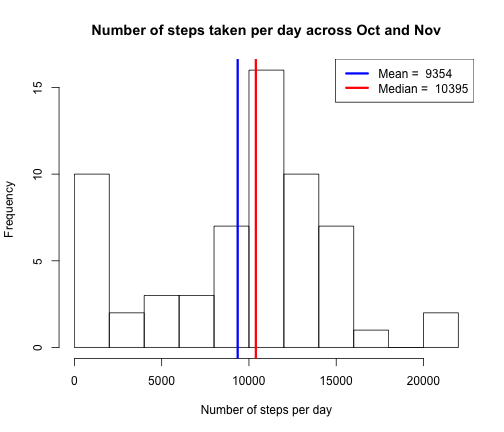
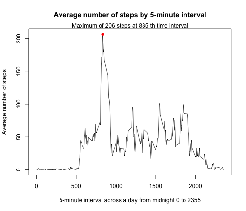
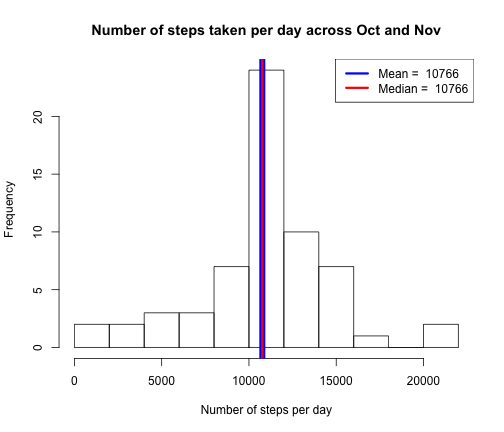

## Introduction

This document contains a report to analyze the data collected from a personal movement monitoring device.  This device collects data at 5 minute intervals through out the day. The data consists of two months of data from an anonymous individual collected during the months of October and November, 2012 and include the number of steps taken in 5 minute intervals each day.


## Loading and preprocessing the data


1. Download the data from course web site, then unzip and load the data file


```r
dat <- read.csv("activity.csv", header = TRUE)
```


2. transform the date variable into date class to prepare for further analysis


```r
dat <- transform(dat, date = as.Date(date))
```


The variables included in this dataset are:

- steps: Number of steps taking in a 5-minute interval (with some missing values)
- date: The date on which the measurement was taken (from 2012-10-01 through 2012-11-30)
- interval: Identifier for the 5-minute interval in which measurement was taken


## What is mean total number of steps taken per day?

First, let's look at the dataset cut by day, studying the total number of steps taken per day


```r
sum_day <- aggregate(dat$steps, by=list(dat$date), FUN=sum, na.rm=TRUE)
```

Further calculate the mean of the total number of steps taken per day


```r
mean(sum_day$x)
```

```
## [1] 9354.23
```

And also the median of the total number of steps taken per day


```r
median(sum_day$x)
```

```
## [1] 10395
```

Let's see all the above findings in a histogram.


```r
hist(sum_day$x, breaks=10, main="Number of steps taken per day across Oct and Nov",
     xlab="Number of steps per day")
abline(v=mean(sum_day$x), lwd = 3, col = 'blue')
abline(v=median(sum_day$x), lwd = 3, col = 'red')
legend('topright', lty = 1, lwd = 3, col = c("blue", "red"), 
       legend = c(paste("Mean = ", round(mean(sum_day$x))), paste("Median = ", round(median(sum_day$x)))))
```

 


## What is the average daily activity pattern?

Next switch over to see the data cut by 5-minute interval averaged across all days


```r
# calculate the average number of steps taken grouped by 5-min interval
avg_interval <- aggregate(dat$steps, by=list(dat$interval), FUN=mean, na.rm=TRUE)
colnames(avg_interval) <- c("interval", "avg_steps")

# further evaluate the maximum point
max <- avg_interval[which.max(avg_interval$avg_steps), ]
```


```r
# make a time series plot (i.e. type = "1")
with(avg_interval, plot(interval, avg_steps, type="l", xlab="5-minute interval across a day from midnight 0 to 2355", ylab="Average number of steps", main="Average number of steps by 5-minute interval"))
with(avg_interval, points(x=max[,1], y=max[,2], pch=19, col="red"))
mtext(paste("Maximum of", round(max[,2]), "steps at", max[,1], "th time interval"))
```

 
 


## Imputing missing values

1. Missing values are a common problem with "quantified self" movement data and so we check to see what proportion of the observations are missing (i.e. coded as NA).


```r
# calculate the number of the missing value records
sum(is.na(dat$steps))
```

```
## [1] 2304
```


2. According to the time series plot above, the average number of steps drops close to zero from the interval 0 to 500 (i.e. midnight to 5 am), which are the sleeping hours.  Therefore it is more sensible to fill the missing values with the mean for that 5-minute interval, which was calculated earlier.

3. Let's create a new dataset with missing data being replaced by the average for that 5-minute interval


```r
# add the 5-min interval average data calculated earlier to the original dataset based on the mutual varaible "interval"
dat_patched <- merge(dat, avg_interval, by="interval")

# duplicate the original steps variable
dat_patched$steps_patched <- dat_patched$steps

# create a logical vector for steps with NA
steps.na <- is.na(dat_patched$steps)

# replace steps by avg_steps only if it is NA
dat_patched$steps_patched[steps.na] <- dat_patched$avg_steps[steps.na]
```

4. Now redo the earlier analysis on the total number of steps per day but using the new dataset with missing data being imputed


```r
# calculate the total number of steps taken per day
sum_day_patched <- aggregate(dat_patched$steps_patched, by=list(dat_patched$date), FUN=sum, na.rm=TRUE)
```

Calculate the mean of the total steps taken per day


```r
mean(sum_day_patched$x)
```

```
## [1] 10766.19
```

Next calculate the median of the total steps taken per day


```r
median(sum_day_patched$x)
```

```
## [1] 10766.19
```

Let's see all the new findings in a histogram.


```r
hist(sum_day_patched$x, breaks=10, main="Number of steps taken per day across Oct and Nov", 
     xlab="Number of steps per day")
abline(v=mean(sum_day_patched$x), lwd = 8, col = 'blue')
abline(v=median(sum_day_patched$x), lwd = 3, col = 'red')
legend('topright', lty = 1, lwd = 3, col = c("blue", "red"), 
       legend = c(paste("Mean = ", round(mean(sum_day_patched$x))), paste("Median = ", round(median(sum_day_patched$x)))))
```

 

Both mean and median increase as compared to the earlier estimates, which ignored missing data.  As the current dataset replaces the missing values by the average, it makes sense that the median value moves close to the mean value.


## Are there differences in activity patterns between weekdays and weekends?

Go back to the view cut by 5-minute interval but further drill down to observe any differences in activity patterns between weekdays and weekends


```r
# add a new variable, day, in the patched dataset, indicating days of the week
dat_patched$day <- weekdays(dat_patched$date, abb=TRUE)

# add a new variable, day_type, indicating the corresponding "weekday" and "weekend"
dat_patched$day_type <- "weekday"
dat_patched$day_type[dat_patched$day %in% c("Sat", "Sun")] <- "weekend"

# calculate the average number of steps taken grouped by 5-min interval
avg_interval_patched <- aggregate(dat_patched$steps_patched, by=list(dat_patched$interval, dat_patched$day_type), FUN=mean, na.rm=TRUE)
colnames(avg_interval_patched) <- c("interval", "day_type", "avg_steps")
```

Make a panel plot showing the time series


```r
library(lattice)
xyplot(avg_steps ~ interval | day_type, data = avg_interval_patched, type="l", layout = c(1, 2), xlab="5-minute interval across a day from midnight 0 to 2355", ylab="Average number of steps", main="Average number of steps across all weekdays or weekends")
```

 

From the plot above, it is seen that the activities of weekdays are more concentrated in the morning hours, while the activities are more spread out across the day during weekends.

